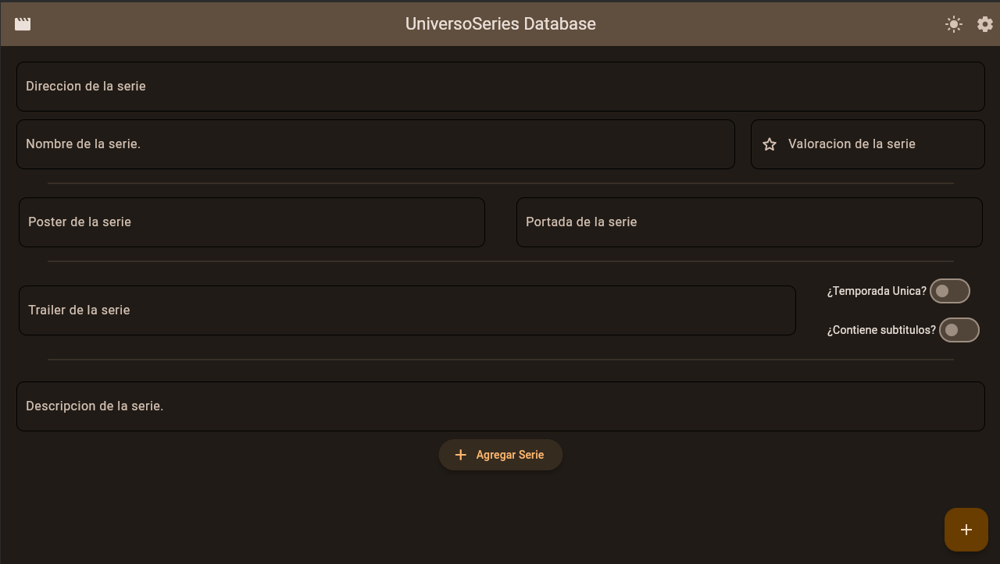

# UniversoSeries Database

Desktop application to fill the database of the UniversoSeries mobile application for the visualization of TV series.

## Screenshots
<div>
  
  
</div>

## Develop Stage
1. Create file `.env` and copy the content from `.env.template`
2. Create environment with this comand `python3 -m venv venv`
4. Active environment with `source venv/bin/activate`
5. Install dependencies `pip install -r requirements.txt`
6. Execute the application with `flet run main.py`

## Build Stage
1. Create file `.env` and copy the content from `.env.template`
2. Create environment with this comand `python3 -m venv venv`
4. Active environment with `source venv/bin/activate`
5. Install dependencies `pip install -r requirements.txt`
6. For comple app execute this comand ```pyinstaller your_program.py --noconsole --noconfirm --onefile --icon <your-image.png>``` 